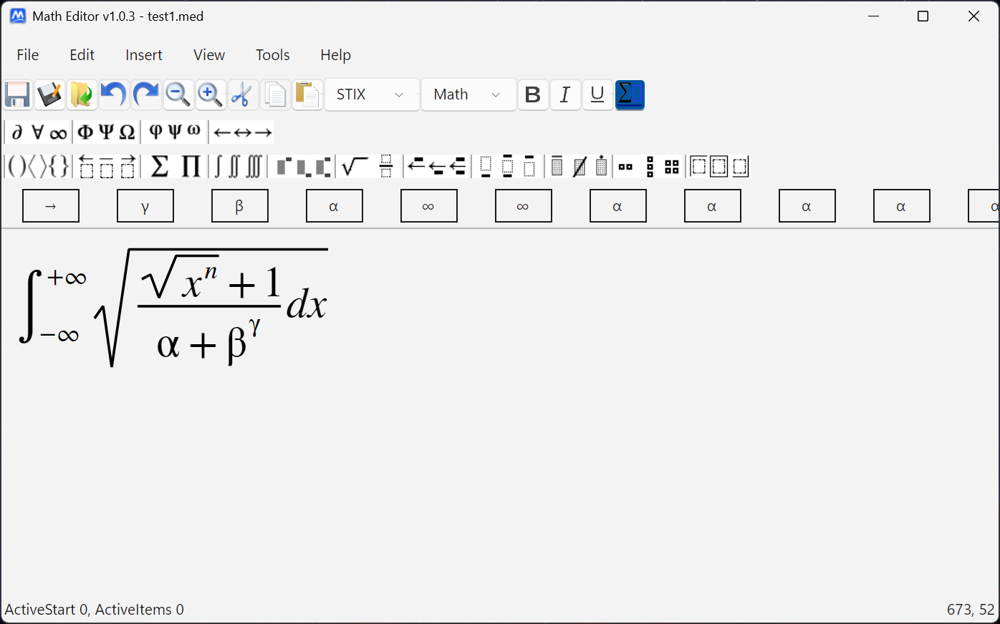
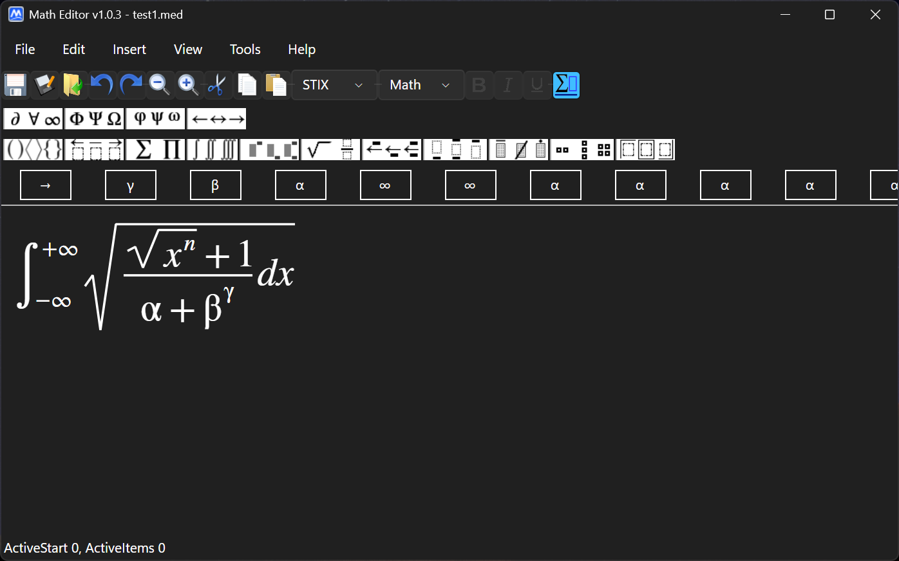
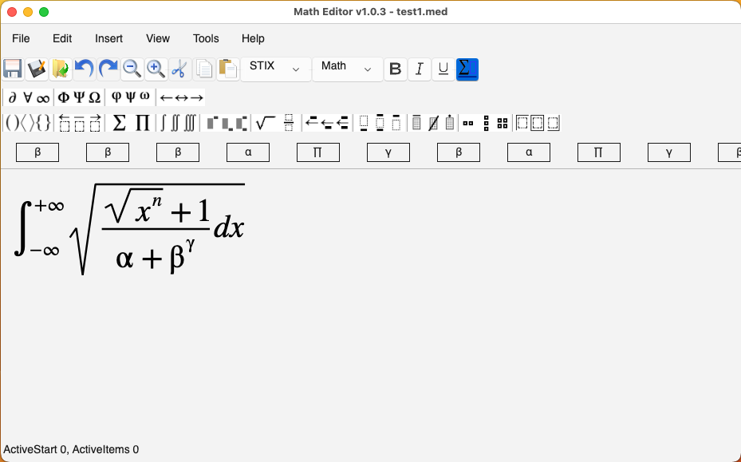
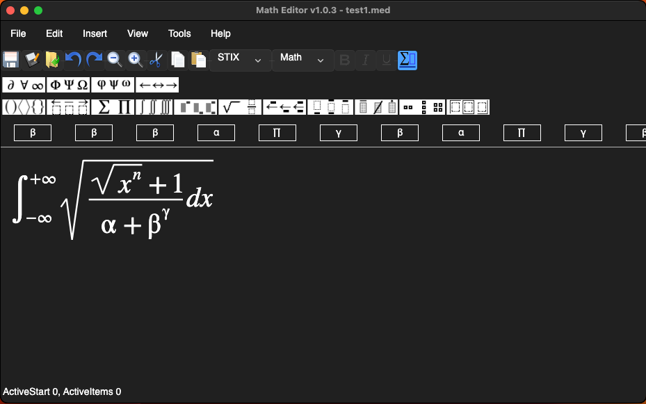
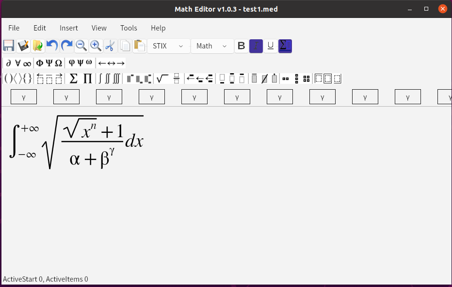

# Math Editor

<p>
  
  
  <a href="https://github.com/Jack251970/Math-Editor/releases/latest"></a>
  
</p>

Open-source, cross-platform equation editor built with Avalonia. A modern, free alternative to MathType for creating mathematical and scientific documents.

- Cross-platform: Windows, macOS, and Linux
- Fast desktop UI: Avalonia 11
- Modern .NET: .NET 9
- Open source: MIT licensed


## 🖼️ Screenshots

### Windows




### MacOS




### Linux



## ⭐ Features

- Rich equation editing with toolbars for:
  - Brackets: round, square, curly, angle, bars, floor/ceiling, mixed combinations
  - Roots and divisions: square root, n-th root, many division layouts (regular, slanted, horizontal, long division, etc.)
  - Sums/products and set operators with limits: Σ, Π, ∐, ∩, ∪ with sub/super and limits
  - Integrals: single/double/triple, contour/surface/volume variants with limits
  - Subscripts/superscripts on either side, and composite operators
  - Arrows (left/right/double/harpoons) and boxes
  - Matrices with quick presets and custom sizes
  - Character decorations (strike-through, crosses, accents and more)
- Copy as Image or LaTeX (switch via settings)
- Export as image (PNG/JPEG/etc.)
- Save files as `.med` (zipped XML) for compact, portable documents
- Zoom (Ctrl + mouse wheel), full screen mode, single-instance launch
- Localization-ready via source generators; English included out of the box
- Logging with Serilog; automatic update support via Velopack


## 🚀 Getting started

### Prerequisites

- .NET 9 SDK or newer: https://dotnet.microsoft.com/download

On Linux you may need standard desktop dependencies for Avalonia/Skia (varies by distro).

### Build & run (CLI)

```
# Restore and build all projects
 dotnet restore
 dotnet build -c Debug

# Run the desktop app
 dotnet run -c Debug --project Editor.Desktop
```

### Build & run (IDE)

- Open the repository in Visual Studio 2022+, Rider, or VS Code (C# Dev Kit)
- Set `Editor.Desktop` as the startup project and run

### Publish self-contained packages (optional)

Examples for common RIDs; adjust as needed:

```
# Windows x64
 dotnet publish Editor.Desktop -c Release -r win-x64 --self-contained true

# macOS x64
 dotnet publish Editor.Desktop -c Release -r osx-x64 --self-contained true

# Linux x64
 dotnet publish Editor.Desktop -c Release -r linux-x64 --self-contained true
```

The output will be under `Editor.Desktop/bin/Release/net9.0/<rid>/publish`.


## 📝 Usage notes

- File format: `.med` files are zip archives containing a single XML payload of the document. The app transparently opens/saves this format.
- Copy behavior: choose between image or LaTeX copy in settings; when LaTeX is selected, Math Editor converts Unicode to LaTeX using an internal mapping (`Editor/Resources/unicode2latex.json`) and built-ins.
- Zoom: hold Ctrl and scroll the mouse wheel; or use the View menu and toolbar.


## 🌏 Localization

This repo includes a lightweight localization toolkit (source generators + analyzers) under `Localization/` and string resources (e.g., `Editor/Languages/en.axaml`).

- Add or edit strings in your `.axaml` language files
- Use the generated `Localize.*` helpers instead of raw keys in code

See `Localization/README.md` for details.


## 🏛️ Project structure

- `Editor` — Core editor logic, UI controls, resources, localization usage
- `Editor.Desktop` — Cross-platform desktop app (entry point) using Avalonia
- `Localization/*` — Localization attributes, analyzers, source generators, and shared helpers

Target frameworks:

- `Editor` and `Editor.Desktop`: `net9.0`
- Shared components may target `netstandard2.0` where applicable

> See https://www.codeproject.com/articles/OOP-in-the-Real-World-Creating-an-Equation-Editor#comments-section for more information

## 📟 Roadmap / ideas

- More LaTeX coverage and round-trip improvements
- Additional export formats (SVG/PDF)
- More built-in keyboard shortcuts and themes
- Extra localizations
- See more in https://github.com/users/Jack251970/projects/4

Contributions are welcome.


## 📚 Contributing

- Open an issue for bugs and feature requests: https://github.com/Jack251970/Math-Editor/issues
- Fork and submit a PR from a feature branch
- Keep changes small and focused; include screenshots for UI changes


## 📄 License

MIT License. See `LICENSE`.

Credits:
- Original concept and article by Kashif Imran (2011 – 2016)
- Modern Avalonia rewrite and ongoing maintenance by Jack251970 (2025 – now)


## ❤️ Thank You

If you are enjoying this app, then please support my work and enthusiasm by buying me a coffee on
[https://ko-fi/jackye](https://ko-fi.com/jackye).

[](https://ko-fi.com/jackye)
